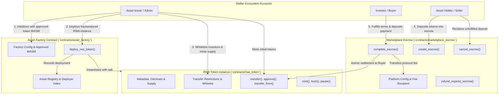

<div align="center">

# AegisMint Labs
### Institutional RWA Tokenization & Peer-to-Peer Marketplace Protocol on Stellar Soroban

[](https://stellar.org/soroban)
[](https://www.rust-lang.org/)
[](LICENSE)
[](https://www.drips.network)
[](https://grantfox.io)

</div>

---

## Overview

AegisMint Labs is a decentralized real-world asset (RWA) compliance launchpad and marketplace built natively on the Stellar network using Soroban smart contracts. It bridges asset issuers, compliance officers, and global traders by enforcing strict on-chain transfer whitelists, deterministic asset factories, and atomic peer-to-peer escrow settlement.

Submitted for evaluation to **Drips Waves** and **GrantFox**.

---

## System Architecture

```text
       [ Asset Issuer ] 
              │
              ▼
   ┌─────────────────────┐
   │    AssetFactory     │ ──(Deploys & Initialises)──► [ RwaToken Contracts ]
   └─────────────────────┘                                       │
              │ (Whitelisting & Compliance)                      │ (Fractional Balances)
              ▼                                                  ▼
   ┌────────────────────────────────────────────────────────────────────────┐
   │                         MarketplaceEscrow                              │
   │            (Atomic P2P Settlement against Stablecoins / USDC)          │
   └────────────────────────────────────────────────────────────────────────┘
```

### Detailed Contract Interactions



### Core Contracts

1. **Asset Factory (`contracts/asset_factory`)**:
   - Manages authorized token implementations via cryptographic WASM hashing (`approved_wasm_hash`).
   - Deterministically deploys tokenized asset instances via address salt derivation.
   - Maintains an indexed, paginated on-chain registry of all minted RWA tokens.

2. **RWA Token (`contracts/rwa_token`)**:
   - Fractional asset representation with configurable precision (decimals) and immutable metadata.
   - Institutional compliance engine featuring account whitelisting (`add_to_whitelist`, `remove_from_whitelist`).
   - Standard Stellar token interface (`transfer`, `approve`, `allowance`, `transfer_from`, `burn`, `mint`).

3. **Marketplace Escrow (`contracts/marketplace_escrow`)**:
   - P2P bilateral escrow system designed for atomic real-world asset settlement.
   - Configurable timeout limits (`min_timeout`, `max_timeout`) preventing locking of liquidity.
   - Configurable platform fee distribution with basis point precision.
   - Automated expiration redemption protecting sellers against non-responsive counter-parties.

---

## 🚀 Quick-Start Guide

### Prerequisites

Ensure the following tools are installed on your machine:
- **Rust Toolchain**: `v1.81+` with `wasm32v1-none` target (`rustup target add wasm32v1-none`)
- **Stellar CLI / Soroban CLI**: `stellar --version` or `soroban --version`
- **GNU Make** (optional, for running convenience recipes)

### Installation & Compilation

```bash
# Clone repository
git clone https://github.com/AegisMint-Labs/aegismint-contract.git
cd aegismint-contract

# Compile all workspace contracts
cargo build --all

# Compile optimized WebAssembly release binaries
cargo build --target wasm32v1-none --release
```

### Running Tests

All unit tests run in Soroban's mock environment without requiring an external node:

```bash
# Run all 32 unit tests across the entire contract workspace
cargo test

# Run tests for a specific contract
cargo test --package asset_factory
cargo test --package rwa-token
cargo test --package marketplace_escrow

# Run tests with stdout output enabled
cargo test -- --nocapture
```

---

## 🌐 Testnet Deployment & Invocation

### 1. Configure Stellar Testnet Identity

```bash
# Generate development identity keypair
stellar keys generate alice --network testnet
stellar keys fund alice --network testnet
```

### 2. Deploy Contracts

```bash
# Deploy Asset Factory
stellar contract deploy \
  --wasm target/wasm32v1-none/release/asset_factory.wasm \
  --source alice \
  --network testnet

# Install RWA Token WASM on-chain for factory deployment
stellar contract install \
  --wasm target/wasm32v1-none/release/rwa_token.wasm \
  --source alice \
  --network testnet

# Deploy Marketplace Escrow
stellar contract deploy \
  --wasm target/wasm32v1-none/release/marketplace_escrow.wasm \
  --source alice \
  --network testnet
```

### 3. Initialize Factory & Deploy Token

```bash
# Set deployment environment variables
FACTORY_CONTRACT_ID="CB7VZCJWUBZZFAFYZYSPATZEOFUZKP2PJ2DNRA6KVC5HYN3FFY5AJ5NP"
RWA_TOKEN_WASM_HASH="b5bb9d8014a0f9b1d61e21e796d78dccdf1352f23cd32812f4850b878ae4944c"

# Initialize factory with approved token WASM hash
stellar contract invoke \
  --id "$FACTORY_CONTRACT_ID" \
  --source alice \
  --network testnet \
  -- initialize \
  --admin alice \
  --approved_wasm_hash "$RWA_TOKEN_WASM_HASH"

# Deploy a new RWA token instance through the factory
stellar contract invoke \
  --id "$FACTORY_CONTRACT_ID" \
  --source alice \
  --network testnet \
  -- deploy_rwa_token \
  --deployer alice \
  --salt "0101010101010101010101010101010101010101010101010101010101010101" \
  --token_admin alice \
  --name "US Treasury 4-Week T-Bill Token" \
  --symbol "USTB" \
  --decimals 7 \
  --total_supply 10000000000000
```

---

## 📁 Repository Structure

```
aegismint-contract/
├── contracts/
│   ├── asset_factory/          # Factory contract for RWA deployment & tracking
│   │   ├── src/lib.rs          # Factory implementation & test suite
│   │   └── Cargo.toml          # Package configuration
│   ├── rwa_token/              # Compliant RWA token implementation
│   │   ├── src/lib.rs          # Token logic, whitelisting & unit tests
│   │   └── Cargo.toml          # Package configuration
│   └── marketplace_escrow/     # Atomic escrow settlement contract
│       ├── src/lib.rs          # Escrow lifecycle, state transitions & unit tests
│       └── Cargo.toml          # Package configuration
├── docs/                       # Architectural & deployment specifications
├── .github/workflows/          # CI/CD pipelines
├── Cargo.toml                  # Workspace manifest
├── CONTRIBUTING.md             # Contribution guidelines & code standards
├── SECURITY.md                 # Vulnerability reporting & security policy
├── LICENSE                     # MIT License
└── README.md                   # Project documentation
```

---

## 👥 Maintainers & Contact

**AegisMint Labs Core Engineering Team**
- **Repository**: [AegisMint-Labs/aegismint-contract](https://github.com/AegisMint-Labs/aegismint-contract)
- **Organization**: [AegisMint Labs](https://github.com/AegisMint-Labs)
- **Technical Inquiries**: dev@aegismint.io
- **Security Inquiries**: security@aegismint.io
- **Grants & Evaluation**: grants@aegismint.io

---

## 📄 License

This repository is licensed under the [MIT License](LICENSE).